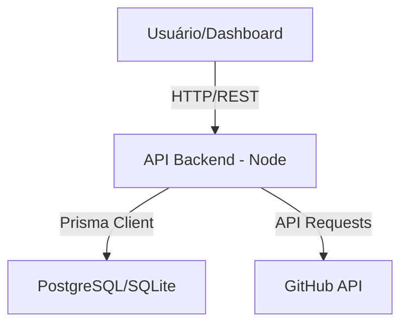

# Arquitetura da Aplicação: CommitDashboard

## 1. Visão Geral
A aplicação segue uma arquitetura em camadas para separar a lógica de negócios, acesso a dados e interface.

*   **Backend:** Node.js + Fastify/Express + Prisma ORM.
*   **Frontend:** React + TypeScript + Tailwind CSS.
*   **Banco de Dados:** PostgreSQL (Produção) / SQLite (Desenvolvimento).

## 2. Diagrama de Camadas


## 3. Estrutura de Dados (Prisma Schema)
```prisma
// prisma/schema.prisma

datasource db {
  provider = "postgresql"
  url      = env("DATABASE_URL")
}

generator client {
  provider = "prisma-client-js"
}

model Repository {
  id        String   @id @default(uuid())
  name      String
  url       String   @unique
  commits   Commit[]
}

model Commit {
  id           String     @id @default(uuid())
  hash         String     @unique
  message      String
  date         DateTime
  authorName   String
  repositoryId String
  repository   Repository @relation(fields: [repositoryId], references: [id])
}
```

## 4. Componentes Chave
*   **Prisma Client:** Acesso seguro e tipado ao banco de dados.
*   **Fetcher Service:** Módulo responsável por chamar a API do GitHub e salvar no Prisma.
*   **Commit Card Component:** Componente frontend que renderiza os dados do commit.

## 5. Fluxo de Execução
1.  O serviço de `fetcher` busca commits novos.
2.  O `Prisma Client` verifica se o commit existe (`upsert`).
3.  O Dashboard frontend chama a API para listar commits (`prisma.commit.findMany`).
4.  Exibição dos cards.
